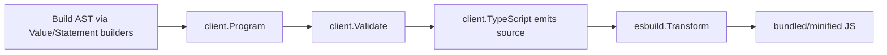

# Architecture

Part of [[Codebase Overview]].

## AST shape

Three sealed sum-types carry the whole tree:

- `expression interface{ expr() }` — expression nodes (`literalExpr`, `callExpr`,
  `binaryExpr`, `propertyExpr`, ...)
- `statementNode interface{ stmt() }` — statement nodes (`declarationStmt`,
  `ifStmt`, `blockStmt`, ...)
- `Type interface{ clientType() }` — the JS type system (`StringType`,
  `Element`, `Nullable[T]`, ...)

All three interfaces are sealed by an **unexported method** — the classic Go
pattern for a closed sum type. Only files inside `package client` can add a
new case, because only they can define a type with an unexported `expr()` /
`stmt()` / `clientType()` method. `emit.go` and `validate.go` type-switch
directly on the unexported concrete structs.

> [!warning] This blocks a naive package split
> Splitting `ast`/`compiler`/`emit`/`validate` into separate Go packages
> would require exporting ~20 internal node types — a public-API redesign,
> not a refactor. See [[Decisions Log#Why browser split but not core]].

## Type system

`Value[T Type]` wraps an AST node with its static JS type:

```go
type Value[T Type] struct{ node expression }
```

Builder functions (`Property`, `Call`, `Binary`, ...) are generic over `T`,
so `Property[Element, StringType](el, "textContent")` fails to compile if
`el` isn't a `Value[Element]`. This is the type safety the whole library is
built around.

`TypeMarker` (in `type.go`) is the one exception, added so a type defined
**outside** `package client` (in `browser/`) can still satisfy `Type` — see
[[Browser Package#TypeMarker]].

## Compile pipeline



- `Validate` never blocks on `SeverityWarning` (e.g. `UnsafeExpression`/
  `UnsafeStatement` usage) — only `SeverityError` aborts `TypeScript()`.
- `Compile`/`CompileWithOptions` run `TypeScript()` output through esbuild
  (`compile.go`) for bundling, minification, and ESM/IIFE format.

## A bug worth remembering

Every public constructor returns a `Value[T]` wrapper. `Value[T].expr()` is
a bare marker method — it does **not** proxy to the wrapped node. Six call
sites (`Call`, `CallValue`, `Join`, `ArrayOf`, `Object`,
`ExpressionStatement`) used to store that wrapper directly instead of
unwrapping it, silently emitting the literal string `"undefined"` for any
argument passed through them. Fixed via `Value[T].unwrapNode()` +
`unwrapExpr()` in `type.go`. Full story in [[Decisions Log#The undefined bug]].
